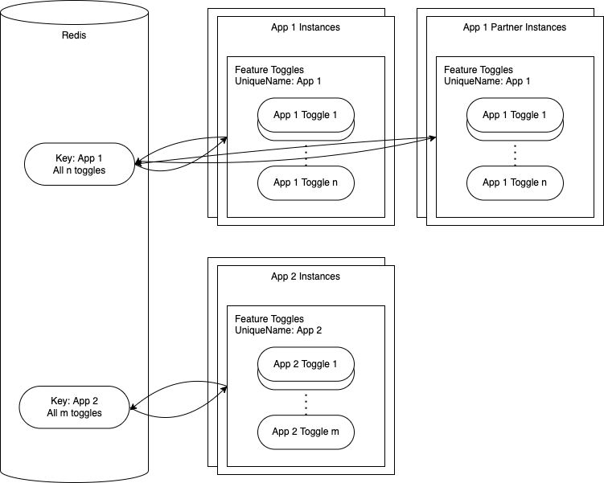

<!-- prettier-ignore-start -->
# Architecture
{: .no_toc }
<!-- prettier-ignore-end -->

<!-- prettier-ignore -->
- TOC
{: toc}

## Initialization

During initialization the Feature Toggles want to synchronize with the central state or lazyly create it based on the
fallback values if necessary. Another goal is to make sure that _current_ validation rules are respected in all cases
and, for example, retroactively applied to the central state.

Initialization broadly has this workflow:

- read the configuration
- validate fallback values and warn about invalid fallback values
- if Redis cannot be reached:
  - use fallback values as local state and stop
- if Redis is reachable:
  - read state and filter out values inconsistent with validation rules
  - publish those validated fallback values, where corresponding keys are missing from state
  - use validated Redis values if possible or, if none exist, fallback values as local state
- subscribe to future updates from Redis

After intialization, usage code can rely on always getting at least the fallback values (including invalid values) or,
if possible, validated values from Redis.

## Single Key Approach

|  |
| :-------------------------------------: |
|        _Single Key Architecture_        |

The current implementation uses a single Redis key to store all the state for one unique name, which is usually
associated with a single app, though the Feature Toggles support the case where multiple apps _with the same
configuration_ use the same unique name. In the diagram you can see both examples, app 1 has a partner app, that uses
the same unique key and all instances of both apps, will synchronize with Redis. On the other hand app 2 is alone,
which is the most common use-case.

Using a single key on Redis for the state of all toggles has some implementation advantages:

- discovery about which toggles are maintained is trivial, no namespacing is needed
- pub/sub change-detection, synchronization, and lock-resolution are also easier

On the other hand, there is also a disadvantage. The sync speed will degrade with the cumulative size of all toggle
states. In practice, if you have lots of toggles with long state strings, it will be slower than necessary.

## Request-Level Toggles

The Feature Toggles are currently implemented with server-level state. They have the limitation that their runtime
values _cannot_ be different based on attributes of individual requests, for example, which tenant is making the
request.

This kind of logic can be implemented outside the Feature Toggles though. You can use a string-type toggle and encode
the relevant states for all tenants, or other discriminating request attributes. During the request processing, you can
get the toggle's state for all tenants and act based on the one making the request.
