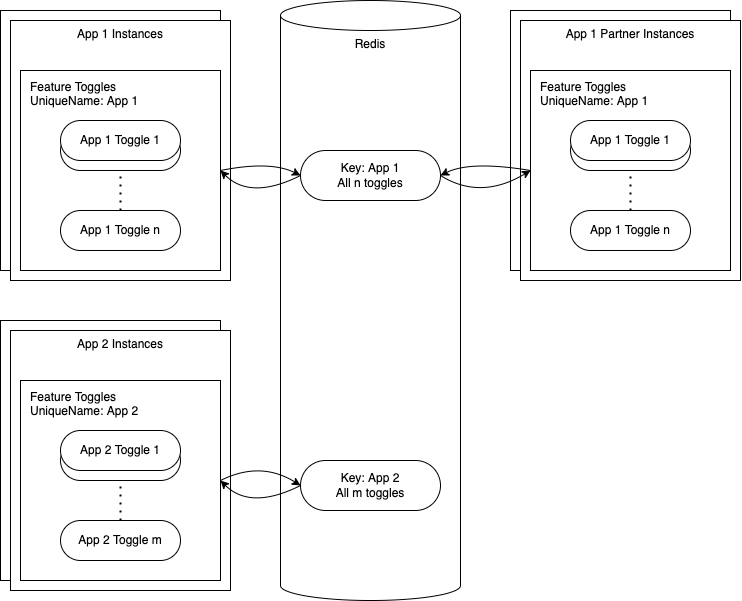
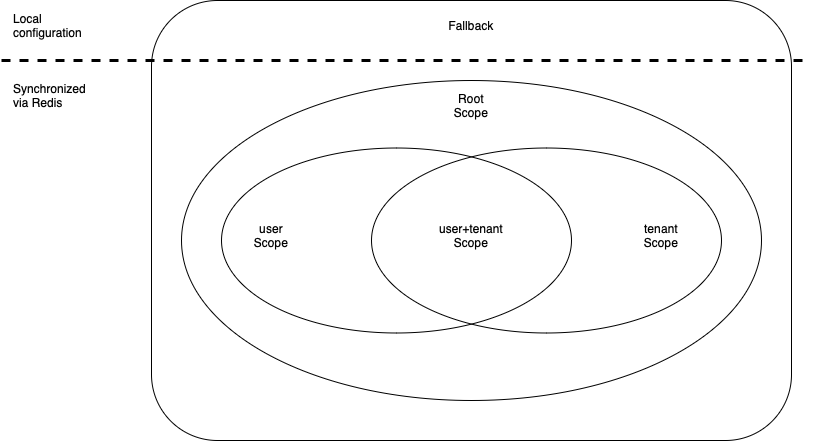

<!-- prettier-ignore-start -->
# Architecture
{: .no_toc }
<!-- prettier-ignore-end -->

<!-- prettier-ignore -->
- TOC
{: toc}

## Initialization

During initialization the Feature Toggles want to synchronize with the central state. Another goal is to make sure
that _current_ validation rules are respected in all cases and retroactively applied to the central state.

Initialization broadly has this workflow:

- read and process the configuration
- validate fallback values and warn about invalid fallback values
- if Redis cannot be reached:
  - use fallback values as local state and stop
- if Redis is reachable:
  - read state and filter out values inconsistent with validation rules
  - use validated Redis values if possible or, if none exist, fallback values as local state
- subscribe to future updates from Redis

After initialization, usage code can rely on always getting at least the fallback values (including invalid values) or,
if possible, validated values from Redis.

## Single Key Approach

|  |
| :-------------------------------------: |
|        _Single Key Architecture_        |

The current implementation uses a single Redis key of type `hash` to store the state of all toggles for one unique
name. A unique name is usually associated with a single app, but the library also supports the case where multiple apps
_with the same configuration_ use the same unique name.

In the diagram you can see both examples, app 1 has a partner app, that uses the same unique key and all instances of
both apps, will synchronize with Redis. On the other hand app 2 is alone, which is the most common use-case.

## Scoping

In their easiest use-cases, the Feature Toggles describe server-level state, which is _independent_ of any runtime
context. Meaning the feature toggle's value will be the same for any request, any tenant, any user, any code component,
or any other abstraction layer. In practice this is often insufficient.

Scoping is our concept to allow discriminating the feature toggle values based on runtime context information.
Let's take a very common example, where both `user` and `tenant` scopes are used.

|                   |
| :-------------------------------------------: |
| _User and tenant scopes for a feature toggle_ |

To realize the distinction, runtime scope information is passed to the library as a `Map<string, string>`, which results
in a corresponding value check order of descending specificity, e.g.:

- `getFeatureValue(key)`
  - root scope, fallback
- `getFeatureValue(key, { tenant: cds.context.tenant })`
  - `tenant` scope, root scope, fallback
- `getFeatureValue(key, { user: cds.context.user.id, tenant: cds.context.tenant })`
  - `user+tenant` scope, `user` scope, `tenant` scope, root scope, fallback
- `getFeatureValue(key, { tenant: cds.context.tenant, user: cds.context.user.id })`
  - `user+tenant` scope, `tenant` scope, `user` scope, root scope, fallback

The root scope is always the least specific or broadest scope and corresponds to _not_ specifying any particular scope
information. Now, the framework will go through these values in order and if any of them are set the most the chain
stops and a response is sent to the caller.

## Request-Level Toggles

TODO this is not true with scoping

The Feature Toggles are currently implemented with server-level state. They have the limitation that their runtime
values _cannot_ be different based on attributes of individual requests, for example, which tenant is making the
request.

This kind of logic can be implemented outside the Feature Toggles though. You can use a string-type toggle and encode
the relevant states for all tenants, or other discriminating request attributes. During the request processing, you can
get the toggle's state for all tenants and act based on the one making the request.
