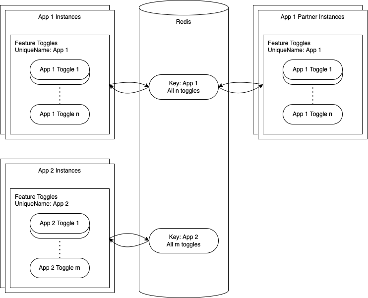
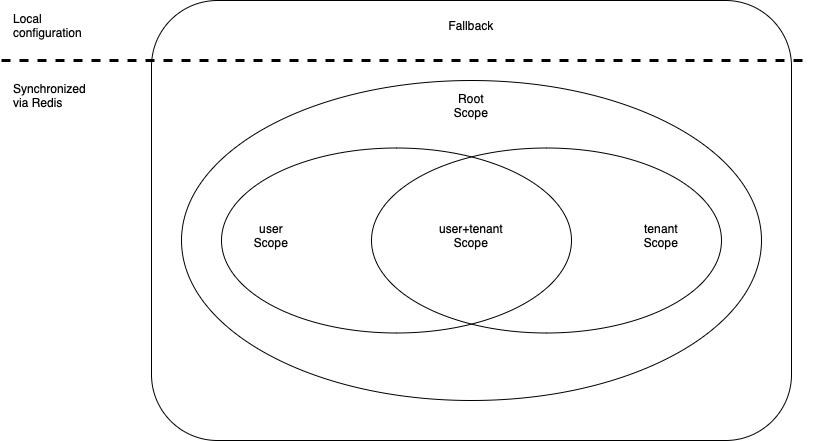

<!-- prettier-ignore-start -->
# Concepts
{: .no_toc }
<!-- prettier-ignore-end -->

<!-- prettier-ignore -->
- TOC
{: toc}

## Initialization

During initialization the Feature Toggles want to synchronize with the central state. Another goal is to make sure
that _current_ validation rules are respected in all cases and retroactively applied to the central state.

Initialization broadly has this workflow:

- read and process the configuration
- validate fallback values and warn about invalid fallback values
- if Redis cannot be reached:
  - use fallback values as local state and stop
- if Redis is reachable:
  - read state and filter out values inconsistent with validation rules
  - use validated Redis values if possible or, if none exist, fallback values as local state
- subscribe to future updates from Redis

After initialization, usage code can rely on always getting at least the fallback values (including invalid values) or,
if possible, validated values from Redis.

## Single Key Approach

|  |
| :--------------------------: |
|         _Single Key_         |

The current implementation uses a single Redis key of type `hash` to store the state of all toggles for one unique
name. A unique name is usually associated with a single app, but the library also supports the case where multiple apps
_with the same configuration_ use the same unique name.

In the diagram you can see both examples, app 1 has a partner app, that uses the same unique key and all instances of
both apps, will synchronize with Redis. On the other hand app 2 is alone, which is the most common use-case.

## Scoping

In their easiest use-cases, the Feature Toggles describe server-level state, which is _independent_ of any runtime
context. Meaning the feature toggle's value will be the same for any request, any tenant, any user, any code component,
or any other abstraction layer. In practice this is often insufficient.

Scoping is our concept to allow discriminating the feature toggle values based on runtime context information.
Let's take a very common example, where both `user` and `tenant` scopes are used.

|                       |
| :-------------------------------------------: |
| _User and tenant scopes for a feature toggle_ |

To realize the distinction, runtime scope information is passed to the library as a `Map<string, string>`, which results
in a corresponding value check order of _descending specificity_, e.g.:

- `getFeatureValue(key)`
  - root scope, fallback
- `getFeatureValue(key, { tenant: cds.context.tenant })`
  - `tenant` scope, root scope, fallback
- `getFeatureValue(key, { user: cds.context.user.id, tenant: cds.context.tenant })`
  - `user+tenant` scope, `user` scope, `tenant` scope, root scope, fallback
- `getFeatureValue(key, { tenant: cds.context.tenant, user: cds.context.user.id })`
  - `user+tenant` scope, `tenant` scope, `user` scope, root scope, fallback

The root scope is always the least specific or broadest scope and corresponds to _not_ specifying any particular scope
information. Now, the framework will go through these potential values in this order and check if any of them have been
set. The first value that has been set stops the chain and is returned to the caller.

With this setup, we can change the resulting value for anyone with tenant `t1`, _and no other, more specific scopes_,
by using

- `changeFeatureValue(key, "new value for t1", { tenant: "t1" })`

And we could change the behavior again with for the more specific user `john` and tenant `t1`, by using

- `changeFeatureValue(key, "new value just for john within t1", { user: "john", tenant: "t1" })`

{: .warn}
As we can see in the precedence check order, if we had just set `changeFeatureValue(key, "new value for john", { user: "john" })`,
then it depends on the order used in the `getFeatureValue` call, whether the `user` scope is evaluated before
the `tenant` scope.

Note that the scoping concept is not opinionated about which particular information you use to discriminate a feature
toggle's value at runtime. There is a practical limit that only 4 scopes can be used at once, because the precedence
checks grow exponentially in the number of scopes. But other than that, you can use any 4 strings. In other words, the
scopes need not be `tenant` or `user`, they could be code component information, like the `__filename`, or whatever
seems natural for you to use and is easy to predict for the user-group where changes should occur.
